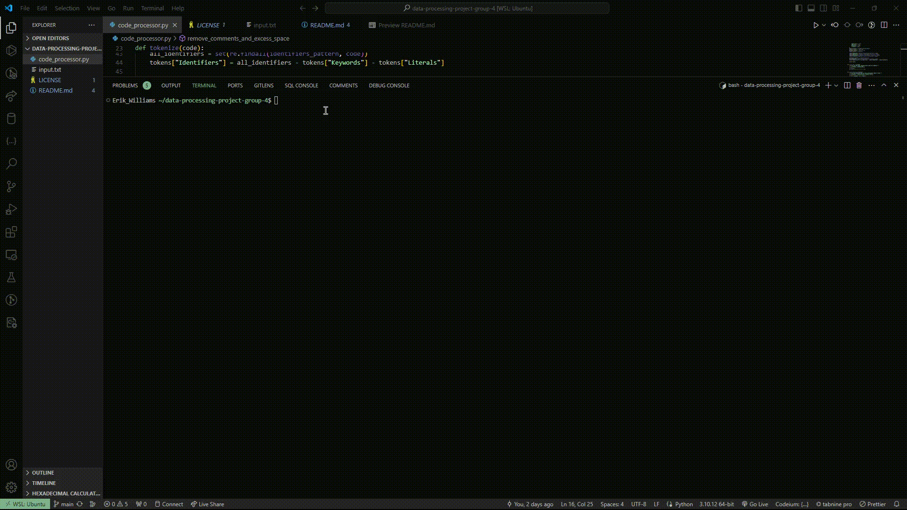

# Data Processing Project

This project aims to develop a comprehensive data processing application designed specifically for analyzing Python code. The application reads data from an input file, meticulously processes the data to remove any excess spaces and comments, tokenizes the remaining code, and finally, presents the output in a clear, tabular format.

## Group Name: Group 4

### Team Members

- **Erik Williams**

  - Email: epwilliams@csu.fullerton.edu
  - [GitHub Profile](https://github.com/EPW80)

    **Alex Le**

  - Email: alexle7@csu.fullerton.edu

- **Member 3 Name**

## Objective

The primary goal of this Python-based application is to:

1. **Read data from an input file:** Seamlessly import Python code from a specified text file for analysis.
2. **Remove excess spaces and comments:** Clean the imported code by removing unnecessary spaces and comments to ensure clarity and conciseness.
3. **Tokenize the cleaned code:** Analyze and categorize the code into tokens such as keywords, identifiers, operators, delimiters, and literals.
4. **Output the cleaned code:** Display the processed code, free from comments and excess spacing.
5. **Display the tokenized code in a tabular format:** Present the tokenized code elements in an easy-to-read table, enhancing understanding and readability.

## Installation & Usage

To use this application, follow these simple steps:

1. **Clone the Repository:**
   git clone git@github.com:CSUF-CPSC-323-Spring24/data-processing-project-group-4.git

2. **Navigate to the Project Directory:**
   cd Data-Processing-Project

3. **Run the Application:**
   python3 code_processor.py

- Make sure you have a Python interpreter installed and an `input.txt` file in the project directory containing the Python code you wish to analyze.\*

## Features

- **Code Cleaning:** Removes all forms of comments and unnecessary whitespace, making the code easier to read and analyze.
- **Tokenization:** Efficiently breaks down the code into manageable tokens, facilitating a deeper understanding of its structure.
- **Professional Output:** Presents results in a professionally formatted tabular output, offering clarity at a glance.

## Demo

## Contributors

Alex Le

Erik Williams
